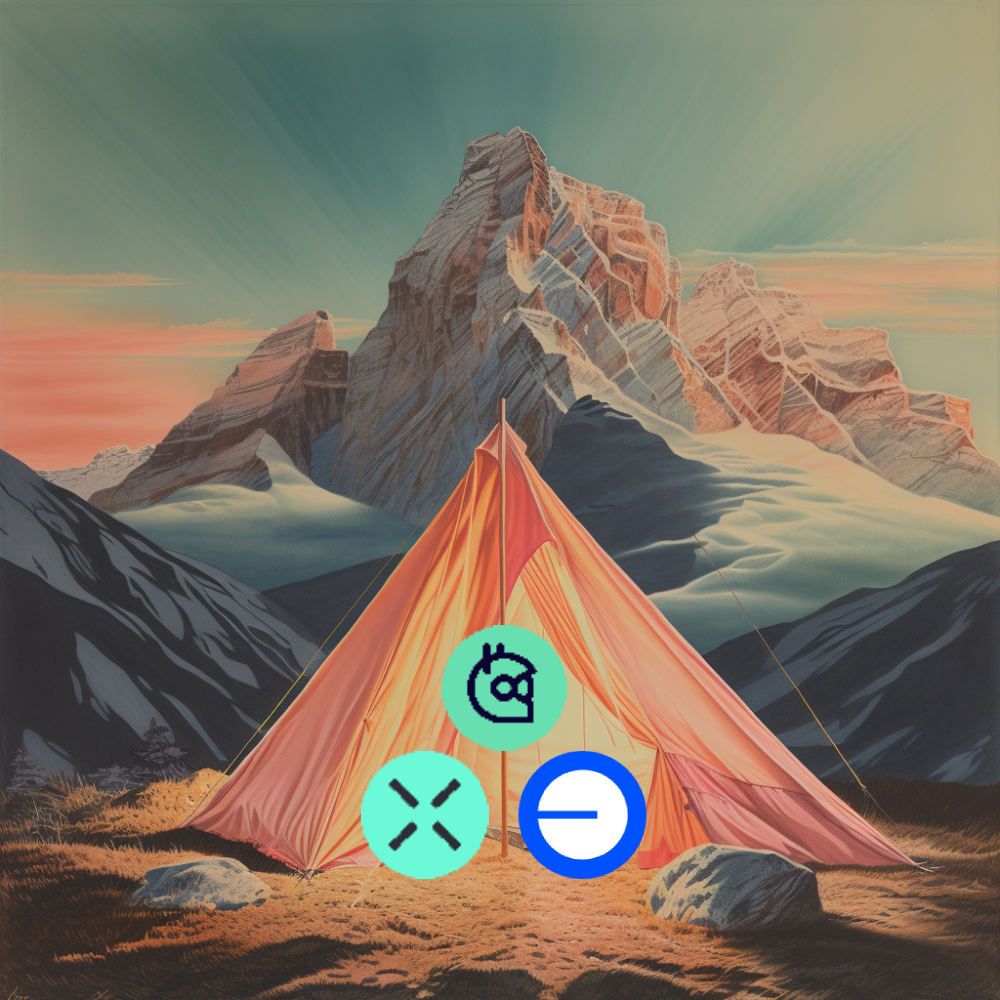

 

  
  <h3 align="center">Cross-chain Gitcoin donations</h3>
  

Donate to Gitcoin public goods from any major EVM chain and Bitcoin.
  

## Problem
There is a conflict of interest between L2s sponsoring Gitcoin rounds, and donors. L2s want to have rounds run exclusively on their chains, while donors want to be able to donate from any network where their money is. We're solving this problem by building an indepepndent frontend interacting with Gitcoin smart contracts and enabling cross-chain donations from all major EVM chains and Bitcoin.

## Challenges
The core feature of Gitcoin is to match donations from individual donors with funds from a matching pool provided by sponsors. The distribution of the matching pool is determined based on the number of donations, the amount donated, and the reputation of the donors. Our solution introduces a bridging interaction between the donor and the Gitcoin contract, which makes it challenging to determine the original donor. We solved this problem by issuing onchain attestations on the Base network via the Ethereum Attestation Service. This provides a relatively easy way for Gitcoin to account for these donations in their matching calculations.

## Tech Stack

- [Across Protocol](https://across.to/)
- [Base](https://www.base.org/)
- [IDriss](https://www.idriss.xyz/)
- Hardhat
- Smart Contracts
  - Donation (Base-Sepolia): [0xfA081C31c2a77c399bdE26b725478191e8e055Ca](https://sepolia.basescan.org/address/0xfA081C31c2a77c399bdE26b725478191e8e055Ca)
  - Donation (Sepolia): [0x43189a22A2629ff405BDD7688732b20101661848](https://sepolia.etherscan.io/address/0x43189a22A2629ff405BDD7688732b20101661848)
  - Wrapper (Base-Sepolia): [0xA3230Af30124545E002D260E7Bd4B8e0097948C6](https://sepolia.basescan.org/address/0xA3230Af30124545E002D260E7Bd4B8e0097948C6)
  - Wrapper (Sepolia): [0xfA081C31c2a77c399bdE26b725478191e8e055Ca](https://sepolia.etherscan.io/address/0xfA081C31c2a77c399bdE26b725478191e8e055Ca)
- EAS
  - [Sepolia](https://sepolia.easscan.org/schema/view/0xddb57ed77bc6860ea21047da3e8609c24a43718376587e4bb61d916011d2a6ca)
  - [Base-Sepolia](https://base-sepolia.easscan.org/schema/view/0xae11a756694e3cf5292b4cb1e3f575acf35c1c0ecda04d188f857c2ac940dd2c)
